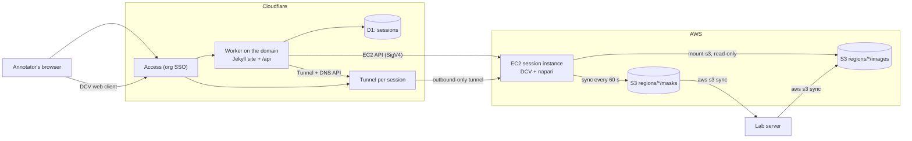
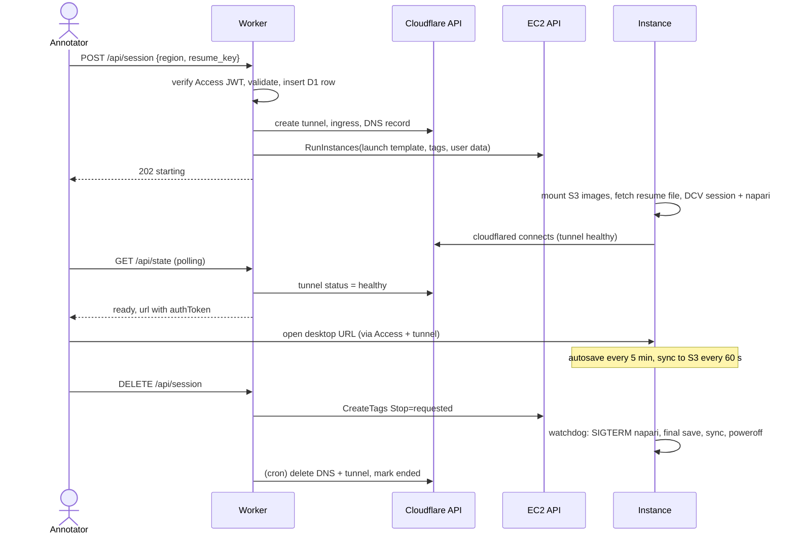

# Plan: browser-based napari segmentation on EC2

> **Status:** built on this branch. See [README.md](README.md) to run it
> locally and deploy it. Where this plan and the code differ, the code is
> right. The changes made while building it:
> - No session caps or budget alarm (decision 6 in section 10).
> - DCV tokens are checked by a small verifier of our own
>   (`desktop/dcv-token-verifier.py`), not `dcvsimpleextauth`.
> - No Cloudflare Access. The site signs people in with the existing Cognito
>   user pool, then acts on AWS as each user: it trades their Cognito token
>   for `annotate-user` role credentials named after their email, and so does
>   their desktop. There are no stored AWS keys at all: the 10-minute
>   cleanup acts as each desktop's owner, and a desktop whose owner's
>   sign-in is gone powers itself off once idle.
> - Deploying is "import the repository into Cloudflare Workers, then add
>   five settings in the dashboard". The database is created on the first
>   deploy and the Worker makes its own tables; Terraform creates the
>   Cognito app client and prints the settings. Sections 3 and 5 still describe an
>   older, hand-configured deploy.
> - Images and masks live in the existing bucket
>   `salk-workstation-data-dev-020125249408`, under
>   `spida_dev/cellpose_3d_test/patches/<brain region>/<region>/<field of view>/`,
>   with `DAPI_decon_z*.tif` directly inside and masks saved to `masks/`
>   beside them. The picker lists the folders live. Terraform only reads
>   that bucket and never changes its settings, so versioning is up to the
>   bucket's owner. The `regions/` layout in sections 4 and 5 is out of date.
> - The AMI is CPU-only until Phase 0 shows a GPU is needed.

Annotators sign in to a website with their organisation account, choose a
region, and click **Start**. An EC2 instance boots with napari already open
on that region, and they paint masks in a browser tab. Masks autosave to S3.
When they finish, or walk away, the instance saves, shuts down and is
terminated.

The napari side is `open_project_anvil.py` with one small addition (see
[section 5.4](#54-changes-to-open_project_anvilpy)). The script already takes
the region directory as an argument and was written for desktops "where you
launch napari yourself -- Anvil's ThinLinc, AWS DCV". This plan is mostly the
plumbing that gets a user to that desktop.

---

## 1. What the annotator sees

1. They go to `https://<domain>/` and sign in with their organisation account
   (Cloudflare Access).
2. They see the site, built with Jekyll from this repo: a short guide and a
   **Start a session** panel.
3. They pick a **region** and a **masks file to resume from**. The default is
   their own most recent masks for that region; they can also start empty.
4. They click **Start**. A status line shows *Starting… (about 3 minutes)*.
5. **Open desktop** appears. It opens `https://s-<id>.<domain>/`, the Amazon
   DCV web client, with napari open on the region and the resumed masks
   loaded.
6. They paint. Autosave runs every 5 minutes (unchanged), and the
   **Save masks** button still works.
7. To stop, they either close napari or click **End session** on the site.
   napari does a final save, masks go to S3, and the instance terminates.
   If they close the tab and walk away, the idle timeout does the same thing.

---

## 2. Architecture



| Piece | Choice | Why |
|---|---|---|
| Sign-in | **Cloudflare Access** in front of everything | No login code to write. It uses the org IdP (Entra ID, Okta or Google), or emails a one-time PIN to `@org` addresses if IT won't federate. Free for up to 50 users. |
| Website | **Jekyll** in `site/`, served as **Workers static assets** | Built from the repo as requested. The same Worker serves the pages and the API on one origin, so no CORS. |
| API and orchestration | The same **Cloudflare Worker** (`/api/*`, plus a cron trigger) | It calls the EC2 API with `aws4fetch` and the Cloudflare API with `fetch`. Nothing else runs permanently. |
| State | **D1** (SQLite), one `sessions` table | A unique index enforces one live session per user, even on a double click. It also gives an audit log of who annotated what, and when. |
| Remote desktop | **Amazon DCV** web client | Free on EC2, handles OpenGL (napari needs it), works in the browser, and the Anvil script already names it. Fallback: the xpra HTML5 setup you already run, through the same tunnel. |
| Reaching the instance | **A Cloudflare Tunnel per session** | The instance has no inbound ports and needs no certificates. Access gives SSO on the desktop URL too. |
| Images | **S3**, mounted read-only on the instance with **Mountpoint for S3** (`mount-s3`) | S3 costs about a thirteenth of EFS per GB, and nothing is copied at boot. The script reads it as ordinary files. |
| Masks | Local disk on the instance, **synced to S3 every 60 s** and at shutdown. S3 versioning is on. | The script's writes (seek, rename, gzip) need a real filesystem. S3 stays the single store the lab server pulls from. |
| Instance image | **AMI built with Packer** and a **launch template** | Boot takes minutes, not a 20-minute install. The Worker only ever says "launch template X". |
| AWS resources | **Terraform** in `infra/` | Reproducible. Cloudflare Access is a few clicks in its dashboard. |

---

## 3. Repo layout (target)

```
.
├── PLAN.md                     # this file
├── site/                       # Jekyll source -> site/_site
│   ├── _config.yml
│   ├── _data/regions.yml       # the regions annotators can open (source of truth)
│   ├── _layouts/default.html
│   ├── index.html              # start / status / open / end session panel
│   ├── guide.md                # how to annotate: shortcuts, saving, resuming
│   ├── regions.json            # Liquid: {{ site.data.regions | jsonify }}, read by the Worker
│   └── assets/session.js       # polls /api/state, drives the panel
├── worker/
│   ├── wrangler.jsonc          # assets dir, D1 binding, cron, custom domain
│   ├── src/index.ts            # router: /api/state, /api/masks, /api/session
│   ├── src/access.ts           # verify Cf-Access-Jwt-Assertion (jose)
│   ├── src/aws.ts              # RunInstances / DescribeInstances / CreateTags / Terminate, S3 list
│   ├── src/tunnel.ts           # create/delete tunnel + DNS record
│   ├── src/reaper.ts           # scheduled(): clean-up and safety nets
│   └── migrations/0001_sessions.sql
├── desktop/                    # everything that runs on the EC2 instance
│   ├── open_project.py         # open_project_anvil.py + save-on-quit (section 5.4)
│   ├── requirements.txt        # pinned from the existing container's `pip freeze`
│   ├── session-boot.sh         # mounts, resume download, DCV session, tunnel
│   ├── start-napari.sh         # DCV session init: window manager + napari
│   ├── watchdog.sh             # every minute: stop request, idle check, poweroff
│   └── systemd/                # annotate-session.service, watchdog.timer, masks-sync.timer
├── ami/annotate.pkr.hcl        # Packer: Ubuntu LTS + DCV + mount-s3 + cloudflared + napari venv
├── infra/                      # Terraform: S3, IAM, VPC/SG, launch template, SSM param
└── .github/workflows/
    ├── site.yml                # jekyll build -> wrangler d1 migrations apply -> wrangler deploy
    └── ami.yml                 # manual: packer build -> write AMI id to SSM
```

---

## 4. Naming and data layout

**Domain.** Register a dedicated domain on Cloudflare (about $10 a year),
shown here as `<domain>`. The site lives at `https://<domain>/` and sessions at
`https://s-<id>.<domain>/`. Cloudflare's free certificate covers the apex and
exactly one level of subdomains, and a Worker custom domain and tunnel DNS
both need the zone to be on Cloudflare. That is why a subdomain of the
organisation's own domain is harder: it would need a paid certificate and,
usually, the org's DNS moved to Cloudflare.

**S3 bucket** `s3://<bucket>/`:

```
regions/<region-id>/images/mosaic_PVARB_z0.tif ...   # uploaded once from the lab server
regions/<region-id>/masks/<user>_<YYYYmmddTHHMMSS>_masks.tif.gz
```

**On the instance**, the region directory the script expects is assembled
from both:

```
/session/<region-id>/images   -> mount-s3 --read-only --prefix regions/<region-id>/images/
/session/<region-id>/masks    -> local disk, synced to regions/<region-id>/masks/
```

**Regions list.** Each entry in `site/_data/regions.yml` looks like this:

```yaml
- id: region_UCI-5224
  label: UCI-5224
```

Adding a region means uploading its images and opening a PR that adds a line
here. Jekyll renders the list into the dropdown and into `/regions.json`. The
Worker validates every launch against that file.

---

## 5. Components

### 5.1 Jekyll site (`site/`)

- Plain Jekyll with one layout and no theme gem, so the build has no surprises.
- `index.html` holds the session panel. It has four states: *no session*
  (region and resume pickers), *starting*, *ready* (**Open desktop** and
  **End session**), and *stopping (saving your masks)*. `session.js` polls
  `GET /api/state` every 5 s while a session is starting or stopping.
- `guide.md` covers napari labels shortcuts, what autosave does, how to
  resume, and browser tips. Use Chrome or Edge. Use DCV's fullscreen so
  shortcuts like `Ctrl+W` reach napari and don't close the tab.
- It is built in CI with `bundle exec jekyll build -s site -d site/_site`.

### 5.2 Cloudflare Worker (`worker/`)

**Config (`wrangler.jsonc`):**

```jsonc
{
  "name": "annotate",
  "main": "src/index.ts",
  "compatibility_date": "2026-09-01",
  "workers_dev": false,            // no *.workers.dev URL that skips Access
  "preview_urls": false,
  "routes": [{ "pattern": "<domain>", "custom_domain": true }],
  "assets": { "directory": "../site/_site", "binding": "ASSETS",
              "run_worker_first": ["/api/*"] },
  "d1_databases": [{ "binding": "DB", "database_name": "annotate", "database_id": "…" }],
  "triggers": { "crons": ["*/10 * * * *"] },
  "vars": { "AWS_REGION": "us-west-2", "LAUNCH_TEMPLATE_ID": "lt-…",
            "BUCKET": "…", "SESSION_DOMAIN": "<domain>",
            "ACCESS_TEAM": "https://<team>.cloudflareaccess.com", "ACCESS_AUD": "…" }
}
```

**Secrets**, set once with `wrangler secret put`:

- `AWS_ACCESS_KEY_ID` and `AWS_SECRET_ACCESS_KEY`
- `CF_API_TOKEN`: Tunnel Edit on the account and DNS Edit on the zone, nothing else
- `DCV_TOKEN_SECRET`

**Auth.** Every `/api/*` request verifies the `Cf-Access-Jwt-Assertion` header
with `jose` (`createRemoteJWKSet` on `${ACCESS_TEAM}/cdn-cgi/access/certs`,
checking issuer and audience). The email comes from the verified token, never
from the request body. POSTs must be `application/json` and carry a matching
`Origin` header.

**Username.** The local part of the email, lower-cased and restricted to
`[a-z0-9._-]`. It becomes `$USER` for napari, so masks keep the
`<user>_<timestamp>_masks.tif.gz` naming.

**D1 schema:**

```sql
CREATE TABLE sessions (
  id           TEXT PRIMARY KEY,          -- 10 random base32 chars; also the hostname
  email        TEXT NOT NULL,
  region       TEXT NOT NULL,
  resume_key   TEXT,
  state        TEXT NOT NULL,             -- starting | ready | stopping | ended | failed
  instance_id  TEXT,
  tunnel_id    TEXT,
  dns_record_id TEXT,
  created_at   INTEGER NOT NULL,
  ended_at     INTEGER
);
CREATE UNIQUE INDEX one_live_session_per_user ON sessions(email) WHERE ended_at IS NULL;
```

**Routes:**

| Route | Does |
|---|---|
| `GET /api/state` | Returns the user and their live session, if any. While the session is `starting`, it checks the tunnel's `status`. The tunnel only connects after DCV is up, so `healthy` means ready. When ready, it adds `url = https://s-<id>.<domain>/?authToken=<token>#annotate`. |
| `GET /api/masks?region=…` | Lists `regions/<region>/masks/` in S3, newest first, with the caller's own files on top. This fills the resume picker. |
| `POST /api/session` `{region, resume_key}` | Validates `region` against `/regions.json` and `resume_key` against that region's masks prefix. Then: 1) inserts the D1 row, and the unique index rejects a second session; 2) creates the tunnel, sets its ingress (`s-<id>.<domain>` → `https://localhost:8443`, `noTLSVerify`), creates the proxied DNS CNAME and fetches the tunnel token; 3) calls `RunInstances` with the launch template, `ClientToken=<id>`, tags `App=annotate`, `Session=<id>` and `Owner=<email>`, and the user data below; 4) stores the ids. On failure it cleans up what it can and marks the row `failed`. The reaper catches anything left over. |
| `DELETE /api/session` | Tags the instance `Stop=requested` and marks the row `stopping`. The instance notices within a minute and shuts down cleanly (section 5.3). It never hard-terminates, because that would drop up to 5 minutes of strokes. |

**User data** is a `#cloud-config` that writes `/etc/annotate/session.env`:

```
SESSION_ID=k3j9x2m4qa
ANNOTATOR=jdoe
REGION=region_UCI-5224
RESUME_KEY=regions/region_UCI-5224/masks/jdoe_20260915T101500_masks.tif.gz
TUNNEL_TOKEN=…
DCV_TOKEN=…
```

**DCV token.** It is `base64url(HMAC-SHA256(DCV_TOKEN_SECRET, session_id))`,
computed on demand and never stored. Access already restricts the desktop
hostname to the org; the token restricts it to the session's owner.

**Cron (`scheduled()`, every 10 min): the reaper.**

- A live row whose instance is `terminated` or missing: delete the DNS
  record and tunnel, and mark the row `ended`.
- `starting` for more than 15 min: the boot failed. Terminate, clean up,
  and mark the row `failed`.
- `stopping` for more than 30 min: the desktop didn't shut itself down, so
  terminate it.
- Any instance tagged `App=annotate` with no live row is an orphan:
  terminate it.

Dependencies are `jose` and `aws4fetch`, nothing else. EC2's Query API
returns XML, and the handful of fields needed (`instanceId`, `instanceState`)
can be read with a small parser.

### 5.3 Session instance (`desktop/`, `ami/`)

**AMI (Packer, `ami/annotate.pkr.hcl`):**

- An Ubuntu LTS release supported by the current Amazon DCV server.
- DCV server and a light window manager (openbox). A small verifier
  (`dcv-token-verifier.py`) accepts only the session's token.
- NVIDIA driver, only if the spike picks a GPU instance.
- `mount-s3`, `cloudflared` and AWS CLI v2.
- A Python venv at `/opt/annotate/venv` built from
  `desktop/requirements.txt`. Pin it by running `pip freeze` in the
  existing lab-server container, so napari behaves exactly as it does today.
- `desktop/*` copied to `/opt/annotate/`, and the systemd units enabled.
- `dcv.conf`: `auth-token-verifier` pointed at the local simple
  authenticator, and `idle-timeout = 60` minutes, after which DCV
  disconnects an idle browser.
- A local `annotate` user with a fixed uid for the DCV session.

The `ami.yml` workflow (manual trigger) runs Packer through GitHub OIDC, so
there is no long-lived AWS key in CI. It writes the new AMI id to SSM
parameter `/annotate/ami`. The launch template uses `resolve:ssm:/annotate/ami`,
so a new AMI takes effect on the next launch with no Worker change.

**Boot (`annotate-session.service`, a oneshot after `cloud-final`, running
`session-boot.sh`):**

1. `set -a; . /etc/annotate/session.env` (written by cloud-init).
2. `mount-s3 --read-only --allow-other --prefix regions/$REGION/images/ <bucket> /session/$REGION/images`.
   Optionally add `--cache /mnt/nvme` on types with instance storage, so
   revisiting a z-plane is fast.
3. `mkdir /session/$REGION/masks`. If `RESUME_KEY` is set, download it to
   `/session/resume/`.
4. `dcv create-session --type virtual --owner annotate --init /opt/annotate/start-napari.sh annotate`,
   with `dcv-token-verifier.py` holding `DCV_TOKEN` as the only accepted token.
5. `cloudflared tunnel run --token "$TUNNEL_TOKEN"`, as its own unit. It
   starts last, so a healthy tunnel means the desktop is ready.
6. Start `masks-sync.timer` and `watchdog.timer`.

**`start-napari.sh`, the DCV session's only program:**

```sh
#!/bin/sh
set -a; . /etc/annotate/session.env; set +a
export USER="$ANNOTATOR"                 # masks are named after the annotator
xfwm4 &                                   # just enough WM to maximise/move napari
resume=${RESUME_KEY:+--resume /session/resume/$(basename "$RESUME_KEY")}
/opt/annotate/venv/bin/python /opt/annotate/open_project.py "/session/$REGION" $resume
# napari exited (window closed, or SIGTERM from the watchdog) -> session ends
```

**`masks-sync.timer`** runs every 60 s:
`aws s3 sync /session/$REGION/masks s3://<bucket>/regions/$REGION/masks --exclude '*.tmp' --exclude '*.staging'`.
The script replaces files atomically, so a finished `.tif.gz` is always
complete. S3 versioning keeps every autosave, and a lifecycle rule expires
old versions after 30 days.

**`watchdog.timer`** runs every minute:

- If the instance tag `Stop` is set (read from IMDS, since the launch
  template enables instance metadata tags), or no DCV client has been
  connected for 30 min (`dcv list-connections annotate`), it sends `SIGTERM`
  to napari. napari saves and exits (section 5.4). The watchdog waits up to
  15 min, because a full-size save can take minutes.
- If napari is no longer running, it does a final `aws s3 sync` and then
  `systemctl poweroff`. `InstanceInitiatedShutdownBehavior=terminate` turns
  that into a termination, and the reaper removes the tunnel and DNS
  record.
- The sync unit is also ordered to run in `ExecStop` on shutdown. A plain
  EC2 terminate still gets a best-effort final save and sync.

The idle rule adds up like this: DCV drops an inactive browser after 60 min,
and 30 min later the instance saves and shuts down. So a forgotten tab costs
at most about 90 minutes of instance time.

### 5.4 Changes to `open_project_anvil.py`

It gets copied to `desktop/open_project.py`. Everything else is reused as is:
lazy per-plane loading, `cache=False`, sparse resume, background saves,
atomic writes, and the 5-minute autosave. The one gap is that **nothing saves
on exit**. Closing napari, or any shutdown, drops up to 5 minutes of strokes.
On a lab server that was the user's choice; here the idle timeout and the
**End session** button would do it for them. The addition to `main()`:

```python
import signal
from qtpy.QtWidgets import QApplication

    # after add_layers / add_save_widget:
    masks = viewer.layers["masks"].data  # painted in place, outlives the window

    def final_save():
        with _save_lock:                  # waits out an autosave mid-write
            _write_masks(np.asarray(masks), "final")

    QApplication.instance().aboutToQuit.connect(final_save)

    # Python only runs signal handlers when Qt hands it the thread; tick it.
    signal.signal(signal.SIGTERM, lambda *_: viewer.close())
    tick = QTimer()
    tick.timeout.connect(lambda: None)
    tick.start(500)
```

Keep the change small and test it: close the window mid-autosave, and send
`SIGTERM` mid-stroke. Both must leave a complete `.tif.gz` holding the last
stroke. It is worth backporting to `open_project.py` for the lab server too.

### 5.5 AWS (`infra/`, Terraform)

- **S3 bucket.** Public access blocked, versioning on, a lifecycle rule for
  noncurrent versions, SSE-S3.
- **Network.** A small VPC with one public subnet, and a security group with
  **no ingress** and all egress (cloudflared uses outbound 443 and 7844). A
  public IPv4 address costs about $3.60 per instance-month while running,
  far less than a NAT gateway.
- **Instance role:**
  - `s3:GetObject` and `s3:ListBucket` on `regions/*/images/*`
  - `s3:GetObject`, `s3:PutObject` and `s3:ListBucket` on `regions/*/masks/*`
  - `s3:GetObject` on `arn:aws:s3:::dcv-license.<region>/*`, DCV's
    free-on-EC2 licence check
  - Nothing else. The annotator effectively has a shell, since napari has a
    Python console, so this role is what they could reach.
- **Launch template:**
  - AMI `resolve:ssm:/annotate/ami` and the chosen instance type
  - gp3 root volume, deleted on termination
  - IMDSv2 required, with instance metadata tags enabled
  - `InstanceInitiatedShutdownBehavior=terminate`
  - The instance profile and the security group
- **Worker IAM user**, the only long-lived key, kept as a Worker secret:
  - `ec2:RunInstances`, limited to this launch template and requiring the
    request tag `App=annotate`
  - `ec2:CreateTags`, on create or on resources tagged `App=annotate`
  - `ec2:TerminateInstances`, on `App=annotate` only
  - `ec2:DescribeInstances`
  - `iam:PassRole` for the instance role only
  - `s3:ListBucket` on `regions/*/masks/`
- **Lab-server IAM user:** read and write on the bucket, for uploading
  images and pulling masks with `aws s3 sync`.
- **GitHub OIDC role** for the Packer workflow.

### 5.6 Cloudflare

- Put the domain on Cloudflare. D1 is created by `wrangler d1 create
  annotate`, and the Worker custom domain by `wrangler deploy`.
- **Zero Trust → Access:** one self-hosted application covering both
  `<domain>` and `*.<domain>`. Its policy allows your IdP group, for example
  "segmentation-annotators", or emails ending in `@<org>` with one-time PIN.
  Copy its **AUD** tag into `ACCESS_AUD`.
- **Two API tokens:**
  - **CI deploy:** Workers Scripts Edit and D1 Edit, stored as GitHub
    secrets `CLOUDFLARE_API_TOKEN` and `CLOUDFLARE_ACCOUNT_ID`.
  - **Worker runtime:** Cloudflare Tunnel Edit and DNS Edit on the zone,
    stored as `CF_API_TOKEN`.

### 5.7 CI/CD

`site.yml` runs on push to `main` when `site/**` or `worker/**` changes:

1. `ruby/setup-ruby` (bundler cache), then `jekyll build -s site -d site/_site`.
2. `actions/setup-node`, then `npm ci` in `worker/`.
3. `cloudflare/wrangler-action`, running `d1 migrations apply annotate --remote`
   and then `deploy`.

Pull requests build the site and type-check the Worker but don't deploy.

`ami.yml` is a `workflow_dispatch` that runs Packer through OIDC and updates
`/annotate/ami`.

---

## 6. Session lifecycle



**How much work can be lost:**

| What happens | Lost work | Why |
|---|---|---|
| User closes napari, clicks **End session**, or goes idle | None | Save on quit, then a final sync |
| Browser or network drops | None | The desktop keeps running. Reconnect from the site. |
| Instance killed outright (hardware failure, forced terminate) | At most about 1 min | The last S3 sync. Local saves happen every 5 min. |
| A bad save overwrites good masks | None | S3 versioning, kept 30 days |

---

## 7. Security summary

- Everything, the site and every desktop, sits behind Access. The Worker
  re-verifies the Access JWT, and `workers.dev` and preview URLs are off, so
  nothing bypasses Access.
- The instances have **no inbound ports**. The desktop is reachable only
  through its tunnel, only after Access, and only with the owner's DCV token.
- Every user input that reaches the instance (region, resume key) is checked
  against an allow-list or prefix before it is written into user data.
  Session ids and usernames are generated or sanitised by the Worker.
- Per-session secrets (the tunnel token and DCV token) die with the session.
  The only long-lived credentials are the Worker's scoped AWS key and
  Cloudflare token.
- Assume the annotator has a shell on their instance, through napari's
  console. The instance role is scoped to the bucket, so the worst case is
  reading other regions or writing masks, and versioning makes the second
  reversible.
- **Get sign-off that this imaging data may be stored in AWS and passed
  through Cloudflare** before uploading anything.

---

## 8. Cost (rough; check current pricing)

| Item | Approx. |
|---|---|
| g4dn.4xlarge (16 vCPU, 64 GiB, T4 GPU) | ~$1.20 per hour while a session runs |
| r6i.2xlarge (8 vCPU, 64 GiB, no GPU) | ~$0.50 per hour |
| S3 Standard | ~$0.023 per GB-month. 1 TB of images is about $23 a month. |
| Public IPv4 and root EBS | Cents per session |
| Cloudflare Workers, D1, Access (≤ 50 users) | Free tier. Workers Paid is $5 a month if CPU limits are hit. |
| Domain | ~$10 a year |

For example, 5 annotators × 3 h a day × 21 days is about 315 instance-hours,
roughly **$380 a month** on g4dn.4xlarge or **$160 a month** on r6i.2xlarge,
plus storage. Nothing costs money while nobody is annotating.

---

## 9. Build order

Each phase ends with something you can check.

**Phase 0: spikes, by hand, before writing any site code.** These are where
the real unknowns are.
1. **Data and instance size.** Upload one real region to S3. On a
   hand-launched instance with DCV, mount it with `mount-s3` and run
   `open_project_anvil.py` unchanged. Measure time to first image, z-switch
   time, peak RSS, and how responsive painting is. Try one GPU type
   (g4dn/g5) and one CPU-only type (r6i, software OpenGL). *Done when:*
   the instance type is chosen and memory headroom is known. RAM must hold
   at least one full plane, plus the painted masks, plus the save.
2. **DCV through Cloudflare Tunnel and Access.** On the same box, run a
   named tunnel to `https://localhost:8443` and put Access in front.
   *Done when:* the DCV web client works through it, napari keyboard
   shortcuts reach napari, and latency is acceptable. If not, try xpra's
   HTML5 client through the same tunnel before changing the architecture.
3. **Sign-in.** Decide between an IdP integration with IT and Access
   one-time PIN. *Done when:* a test user can sign in to a placeholder
   hostname.

**Phase 1: site skeleton.** Jekyll in `site/`, a Worker serving it on
`<domain>` behind Access, the `site.yml` deploy, and a `/api/state` that
returns only the verified email. *Done when:* a push to `main` updates the
site, and only org users can load it.

**Phase 2: instance.** `desktop/` scripts, the save-on-quit change and its
tests, the Packer AMI, and the Terraform launch template, bucket and IAM.
*Done when:* `aws ec2 run-instances --launch-template … --user-data file://test.yaml`,
with a tunnel token made by hand, gives a working desktop with napari on the
region, masks appear in S3 within a minute of an autosave, and closing napari
terminates the instance.

**Phase 3: orchestration.** D1 migration, `POST`, `GET` and `DELETE`
session, `/api/masks`, and the session panel UI. *Done when:* Start → Open
desktop → paint → End session works from the browser, and leaves no
instance, tunnel or DNS record behind.

**Phase 4: safety nets.** The watchdog idle rule, and the reaper (stale,
failed, stuck stopping, orphans).
*Done when:* these drills pass:
- close the tab and leave it: instance gone within about 90 min
- kill the instance from the console: at most 1 min lost, tunnel and DNS
  cleaned by the next cron
- double-click Start: exactly one instance
- a user with a session already live gets told so

**Phase 5: pilot.** 2–3 annotators for a week. Fill in `guide.md` from their
questions. Write a short runbook: add a region, update the AMI, rotate the
Worker's AWS key, restore a masks version from S3, and pull masks to the lab
server.

Later, only if the pilot shows the need:
- A warm pool of stopped instances, if the 2–4 minute boot annoys people.
- Spot instances. Save on quit makes a 2-minute interruption notice mostly
  survivable.
- Per-region permissions.

---

## 10. Decisions

1. **Domain:** not decided yet. It will be one of the organisation's
   existing domains. The zone must be on Cloudflare for the Worker's custom
   domain and the desktops' tunnel DNS. If desktop hostnames sit two levels
   below it (`s-<id>.annotate.<org>`), the free certificate won't cover
   them, so pick a pattern one level down (`annotate-<id>.<org>`) or add
   Advanced Certificate Manager.
2. **Sign-in:** the existing Cognito user pool, used by the site directly
   (this replaced the emailed one-time PIN). Anyone who can sign in to the
   pool gets in. Starting desktops and using the bucket happen as that user.
3. **Region and data:** us-west-2, and the existing bucket
   `salk-workstation-data-dev-020125249408`, with regions under
   `spida_dev/cellpose_3d_test/patches/`.
4. **Instance type:** from Phase 0.1. Terraform defaults to r6i.4xlarge
   (128 GiB).
5. **Resuming:** anyone can resume from anyone's masks in the same region.
6. **Limits:** none. No per-user or concurrent caps and no budget alarm.
   The idle shutdown and the reaper stay, because they are about instances
   nobody is using rather than about spend.

## 11. Risks

| Risk | Mitigation |
|---|---|
| DCV over the tunnel is laggy or breaks shortcuts | Phase 0.2 tests it first. Fallback: xpra HTML5 through the same tunnel (known to you), or a DCV public endpoint with a proper certificate. |
| Planes too large for RAM, or too slow from S3 | Phase 0.1 measures it. Tune with `mount-s3 --cache` on instance-store NVMe, or copy the region to NVMe at boot. |
| GPU driver and DCV setup on Linux is fiddly | Try CPU-only with software OpenGL first. Only bake NVIDIA drivers into the AMI if it's needed. |
| Instances left running | Idle shutdown, the reaper's stuck-stopping rule and orphan sweep |
| Lost annotation work | Autosave, save on quit, 60 s S3 sync, S3 versioning (section 6 table) |
| Long-lived Worker AWS key leaks | Tightly scoped IAM (can only launch this template and kill its own instances), plus a rotation step in the runbook |
